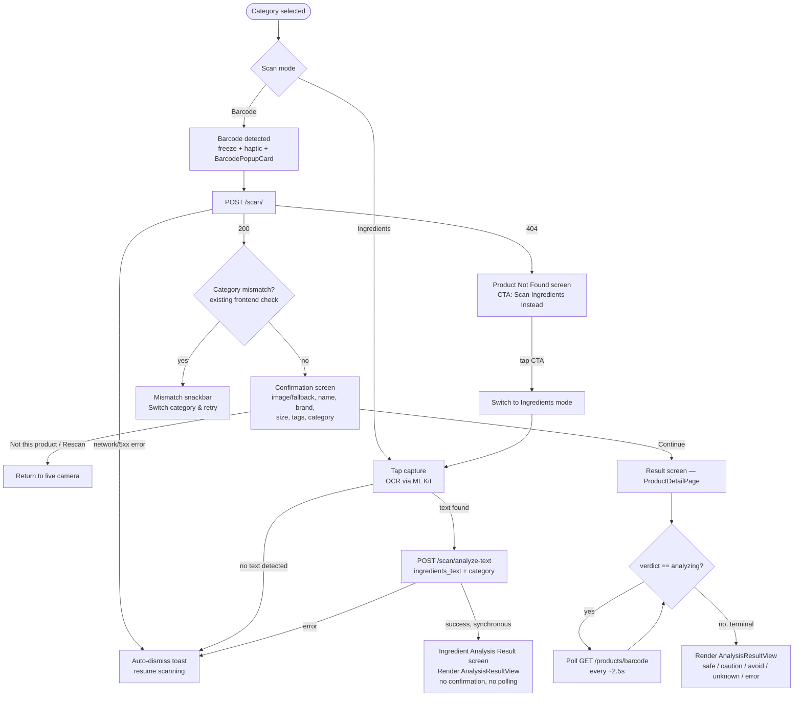
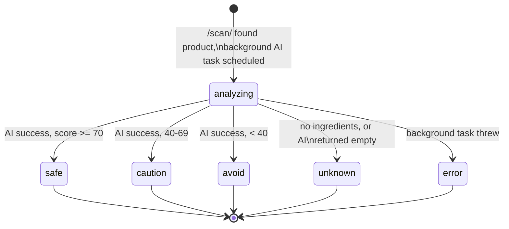

# Scan result system: confirmation, analysis, and edge cases (FE + BE)

## Context

The scan page (barcode + ingredients-OCR modes) is built and working, but
nothing happens after a successful scan today — `ScanBarcodeUseCase` and
`GetProductUseCase` are both `UnimplementedError` stubs, `ProductDetailPage`
is a one-line placeholder, and `ScanPage._handleScanBlocState` just calls
`Navigator.pop()` on success. This document designs the real result
experience end-to-end — for both the barcode flow and the ingredients-OCR
flow — covering the edge cases that come up once real backend data is in
play: missing images, products not found in any database, the AI still
processing, and what "recommend an alternative" can honestly mean without
a specific product identity.

This was investigated against the **actual backend code**
(`../scanrix-backend`) and **live-tested with curl** against the real Open
Beauty Facts API (not assumed) before designing anything:
- A real barcode (`8001090662231`) returns full data including a real
  `image_url` and 41 ingredients.
- A nonexistent barcode returns `{"status": 0}` — confirmed this is what
  produces the backend's `404 "Product not found in any database"`.
- `image_url` is genuinely nullable end-to-end (external API can omit it).

## Ground truth (verified, not assumed)

| Endpoint | Behavior |
|---|---|
| `POST /scan/` | Checks Mongo first; if not cached, races Open Food Facts + Open Beauty Facts. Found → persists immediately with `verdict="analyzing"`, kicks off AI as a **fire-and-forget background task**, returns right away (never blocks on AI). Not found anywhere → `404`. |
| `GET /products/{barcode}` | Returns the persisted product. `404` if barcode was never scanned. `verdict` is the only progress signal — no separate status endpoint, no webhook/SSE. |
| `POST /scan/analyze-text` | Takes **only** `ingredients_text` + `category` — no product identity, ever. Runs the AI **synchronously inline** and returns the final result in one call — never "analyzing", nothing persisted. |
| `verdict` values | `"analyzing"` (non-terminal) → `"safe" \| "caution" \| "avoid"` (AI success), `"unknown"` (no ingredients / empty AI result), `"error"` (background task threw). All four non-`analyzing` values are terminal. |
| Category-vs-content mismatch | Frontend-only today (`ScanCategoryX.fromBackendLabel` keyword match) — backend has zero such logic, for either flow. Already implemented, keep as-is. |
| Confirmation / verification step | **Does not exist server-side at all** — purely a frontend construct built on data `/scan/` already returns. |
| AI summary | The **same** `ai_service.analyze_ingredients()` generates a `summary` for both flows, but `update_product_analysis` (backend, barcode path) only `$set`s `overall_score`/`verdict`/`ingredients` — **the summary is silently dropped** for barcode results. `/scan/analyze-text` returns it inline, unfiltered, so ingredients-flow results already have it. |
| Category tags (e.g. "Shampoos", "Hair Care") | Available in the raw Open Food/Beauty Facts response (`categories_hierarchy`) but the backend parser **throws it away** — `category` is hardcoded to `"cosmetic"`/determined food-or-not, no tag list is captured or exposed. |
| Product size/quantity (e.g. "150 ml") | Same story — present in the raw external response (`quantity`), not captured or exposed today. |

## Decisions made

- **Ingredients-flow AI context**: category + ingredient text is sufficient — no product-type picker added. (Route-of-exposure — topical vs. ingested — drives ingredient risk more than the specific product subtype; confirmed as a reasonable default, not a hard requirement.)
- **Alternatives**: ingredient-level guidance only ("avoid X", "look for Y-free") in both flows — no named-product suggestions, since only the barcode flow has enough product identity for that, and even there no catalog/logic for it exists.
- **Analyzing state**: confirm first (image/name/brand from the already-returned `/scan/` data), *then* push a polling result screen — not a silent pre-confirmation wait.
- **Not-found recovery**: dedicated full-screen state with a primary "Scan Ingredients Instead" CTA.
- **Backend summary-drop**: fix it — persist `summary` too, so barcode results aren't structurally worse than ingredients results.
- **Confirmation screen**: new full-page screen (design provided), shown *after* the existing barcode-detected freeze/haptic/`BarcodePopupCard` beat, once `/scan/` has resolved. Not a replacement for that existing motion.
- **Tags**: include in v1 — worth the small backend addition, bundled with the summary fix and the quantity field (same "parse more from the external API" change).
- **Errors**: not-found gets its own screen; other/generic errors (network, 5xx) stay as a lightweight **auto-dismissing toast** (not a Material `SnackBar` — explicitly asked for something that "comes and goes fast", not queued/dismiss-by-swipe).

## Flow diagram



## Verdict state diagram (barcode flow only — text-analysis flow has no "analyzing" state)



## Edge-case matrix

| Mode | Category | Backend outcome | Screen shown |
|---|---|---|---|
| Barcode | either | `/scan/` 200, `image_url` present | Confirmation (real photo) → Result |
| Barcode | either | `/scan/` 200, `image_url` null | Confirmation (category placeholder asset: `assets/images/cosmetics.png` / `food.png`) → Result |
| Barcode | either | `/scan/` 404 | Product Not Found screen |
| Barcode | either | `/scan/` network/5xx error | Toast, resume scanning (unchanged behavior) |
| Barcode | cosmetics selected, product is actually food (or vice versa) | 200, category mismatch detected client-side | Existing mismatch snackbar → switch & retry (unchanged) |
| Barcode | either | 200, verdict already terminal (rescanned/cached product) | Confirmation → Result renders immediately, no polling |
| Ingredients | either | OCR text empty/unreadable | Toast, stay on camera |
| Ingredients | either | `analyze-text` 200 | Ingredient Analysis Result — direct, no confirmation |
| Ingredients | either | `analyze-text` error | Toast, stay on camera |
| Either | switch category mid-session via bottom-bar dropdown | n/a | Already works unchanged — `_switchCategoryAndRetry` re-dispatches only if a barcode is in flight; no-ops harmlessly in ingredients mode |

## Backend changes (`../scanrix-backend` — separate repo/session)

1. **`app/schemas/product.py`**: add to `ProductBase` (flows into both `ProductCreate` and `ProductResponse`):
   ```python
   tags: List[str] = []
   quantity: Optional[str] = None
   ```
   Add to `ProductCreate`/`ProductResponse` directly (AI-produced, not source data):
   ```python
   summary: Optional[str] = None
   ```
   **Critical**: these must be declared on `ProductResponse` specifically — FastAPI's `response_model` strips any dict keys not declared on the schema, so even if Mongo has the data, it won't reach the client without this.

2. **`app/services/openfoodfacts_service.py` and `openbeautyfacts_service.py`** (`_parse_product` in both): add
   ```python
   "tags": self._parse_tags(product.get("categories_hierarchy", [])),
   "quantity": product.get("quantity"),
   ```
   `_parse_tags`: strip the `en:` prefix, replace hyphens with spaces, title-case, dedupe, cap to ~3 entries, skip the most generic ones (`health-beauty`, `personal-care`, `food`, etc. — same shape of heuristic in both services since they hit the same API family).

3. **`app/crud/crud_product.py::update_product_analysis`**: add `"summary": analysis_data.get("summary")` to `update_data`.

4. **`app/models/product.py::product_helper`**: add `"summary": product.get("summary")`, `"tags": product.get("tags", [])`, `"quantity": product.get("quantity")` to the returned dict.

No changes needed to `scan.py` itself — `create_product` persists whatever dict keys `_parse_product` produces, so `tags`/`quantity` flow through automatically once added there.

## Frontend changes (this repo)

### Data/domain layer
- `ProductEntity`/`ProductModel`: add `summary: String?`, `tags: List<String>`, `quantity: String?` (mirrors the backend additions above).
- `ScanBarcodeUseCase` (`scan/domain/usecases/scan_barcode_usecase.dart`): wire to `ApiClient.post(ApiConstants.scan, data: {'barcode': barcode})`, parse with `ScanResultModel.fromJson` — same pattern as `GoogleLoginUseCase`/`AnalyzeTextUseCase`.
- `GetProductUseCase` (`products/domain/usecases/get_product_usecase.dart`): wire to `ApiClient.get(ApiConstants.productByBarcode(barcode))`, parse with `ProductModel.fromJson`. Reused for both the confirmation screen's initial data *and* the result screen's polling.
- `ScanCategory.backendValue`: fix `'cosmetics'` → `'cosmetic'` to match the backend's actual convention (`ProductBase.category` comment: `"food" | "cosmetic" | "household"`) — currently sends the wrong string (harmless today since it's freely interpolated into the AI prompt, but should still match).
- `ScanFailure` (`scan/presentation/bloc/scan_state.dart`): add `final int? statusCode;` so the UI can distinguish 404 from other errors. `ScanBloc._onScanBarcodeRequested`'s catch block passes `e is ServerException ? e.statusCode : null`.

### Navigation rewrite (`ScanPage._handleScanBlocState`)
Replace the current bare `Navigator.pop()`/generic-snackbar behavior:
- `ScanBarcodeSuccess`, no mismatch → `Navigator.push` to `ScanConfirmationPage(result: state.result)`.
- `ScanFailure(statusCode: 404)` → `Navigator.push` to `ProductNotFoundPage`; if it pops with `true` (user tapped "Scan Ingredients Instead"), call `_onModeChanged(ScanMode.ingredients)`.
- `ScanFailure` (other) → show the new toast, resume scanning (same recovery logic as today, just swapping the SnackBar for the toast).
- `ScanTextAnalysisSuccess` → `Navigator.push` to `IngredientAnalysisResultPage(analysis: state.analysis)` directly (supersedes the earlier "just pop" placeholder now that the real page exists).

### New widgets/pages
- **`lib/core/widgets/toast.dart`** — `showToast(BuildContext, String message, {IconData? icon})`: an `OverlayEntry`-based auto-dismissing pill (~1.6s, fade in/out, no swipe/queueing), replacing the current red `SnackBar` used for generic scan failures.
- **`ScanConfirmationPage`** (`scan/presentation/pages/scan_confirmation_page.dart`) — per the provided design: product image (`Image.network` with `errorBuilder`/`loadingBuilder` falling back to `category.assetPath` whenever `imageUrl` is null *or* fails to load), "Product Identified" badge, category pill, name, brand + quantity, tag pills (`product.tags`), "Is this the correct product?" card with **Not this product** / **Continue**, **Rescan** action top-right. "Not this product" and "Rescan" both just pop back to the live camera (functionally identical entry points, per the design) — `Continue` pushes `ProductDetailPage`.
- **`ProductDetailPage`** (rebuilt, `products/presentation/pages/product_detail_page.dart`) — becomes the barcode-flow result screen. Wraps the existing (currently unused) `ProductBloc`, dispatches `ProductRequested(barcode)` on a `Timer.periodic` (~2.5s) while `product.isAnalyzing`, cancels on terminal verdict or dispose. Renders `AnalysisResultView` once terminal.
- **`IngredientAnalysisResultPage`** (`scan/presentation/pages/ingredient_analysis_result_page.dart`) — takes a `TextAnalysisEntity` directly (already resolved, no bloc/polling needed), lighter header (category badge + "Scanned Ingredients" label, no image/name since there's no product identity), renders the same `AnalysisResultView`.
- **`AnalysisResultView`** (shared presentational widget, e.g. `products/presentation/widgets/analysis_result_view.dart`) — takes plain params (`verdict`, `overallScore`, `summary`, `ingredients`) so both result pages feed it regardless of source entity type. Verdict-colored badge/header, score, summary blurb (when present), ingredient list with per-ingredient concern chips, and a "Things to watch out for" section built from ingredients with non-empty `concerns` — this is what stands in for "alternatives" per the ingredient-level-guidance decision.
- **`ProductNotFoundPage`** (`scan/presentation/pages/product_not_found_page.dart`) — full-screen message, primary **Scan Ingredients Instead** CTA that pops `true`.

## Verification
- Backend: after making the schema/CRUD changes, re-run the same curl flow used in this investigation — `POST /scan/` with a real barcode, then poll `GET /products/{barcode}` — confirm `summary`, `tags`, and `quantity` actually appear in the JSON response (not just present in Mongo).
- `flutter analyze` clean after the frontend changes.
- Manual run through every row of the edge-case matrix on a real device against the running backend: found-with-image, found-no-image, not-found → switch to ingredients, category mismatch (unchanged), already-analyzed rescan (no polling delay), analyzing → polling → terminal, and the ingredients-OCR direct-result path.
- Confirm the toast actually auto-dismisses without blocking taps on the camera underneath (the thing the SnackBar didn't do well).
